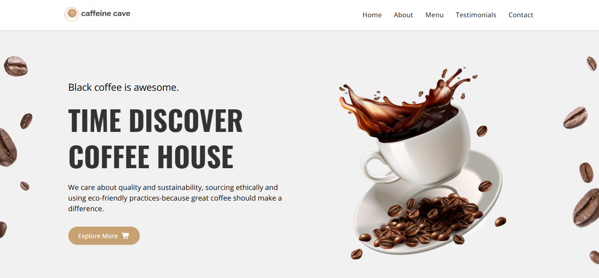

# ☕ Caffeine Cave

A modern, minimalist landing page for a specialty coffee house, featuring a dark "cavernous" aesthetic and premium brewing showcase.

---

## 🌐 Live Demo

Check it live: [Caffeine Cave](https://suhaibadill.github.io/caffeine-cave/)

---

## 🖼 Screenshot

  

---

## 💻 Technologies Used

- **HTML5:** Semantic structure for better accessibility.
- **CSS3:** Custom properties, Flexbox, and Grid for a modern layout.
- **Google Fonts:** Montserrat and Playfair Display for a premium look.
- **Responsive Design:** Optimized for all screen sizes (Mobile, Tablet, Desktop).
